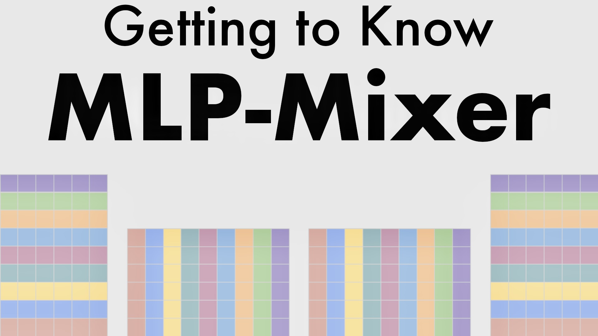
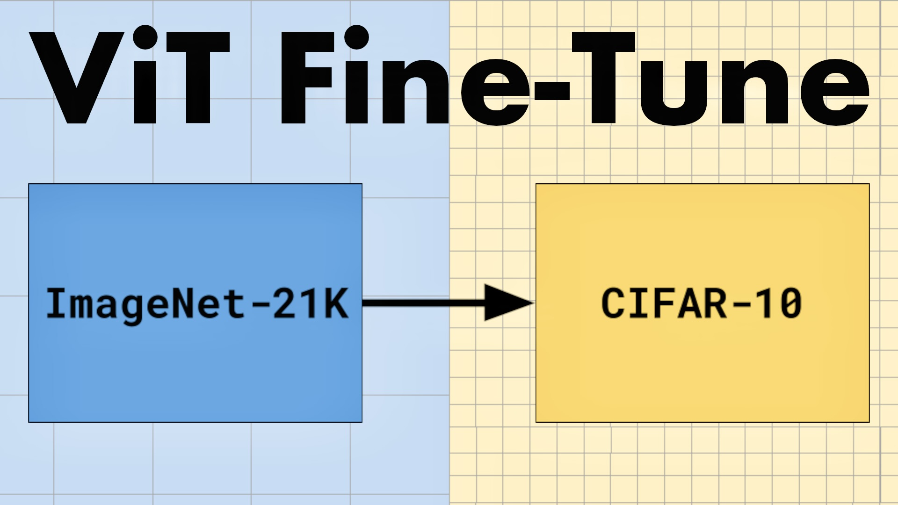
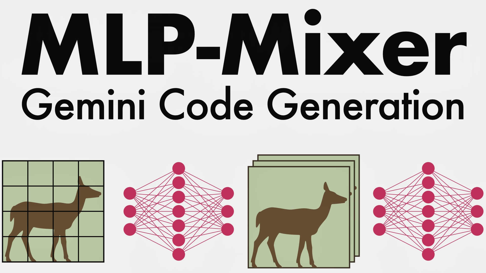
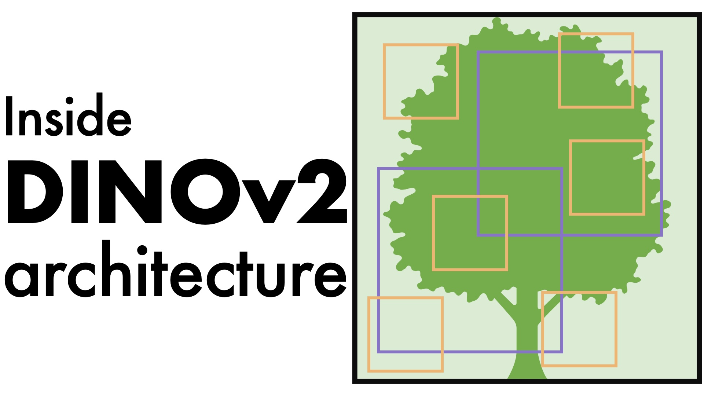
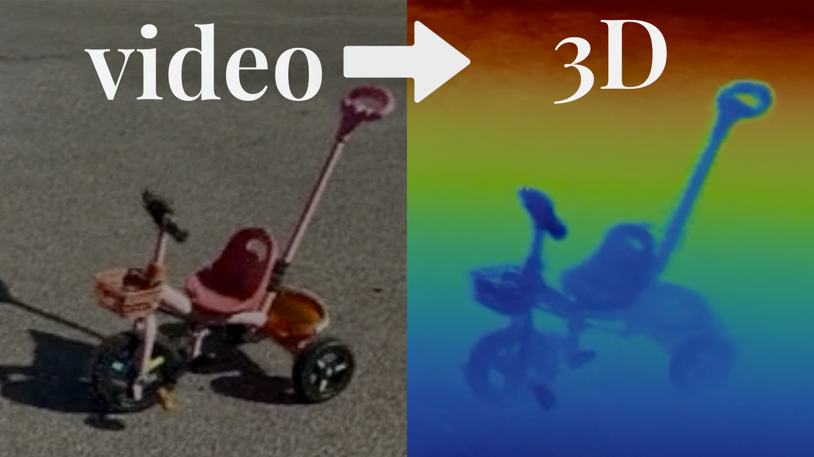
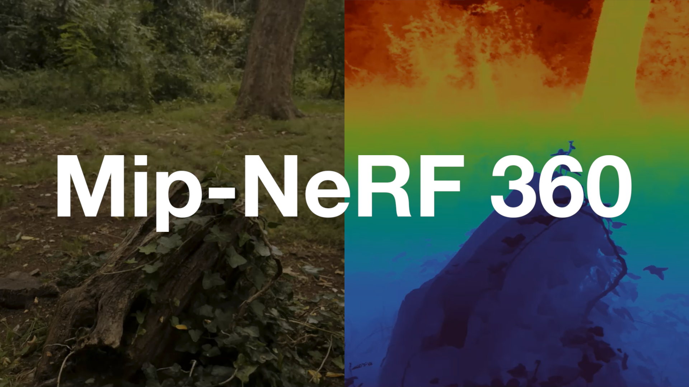
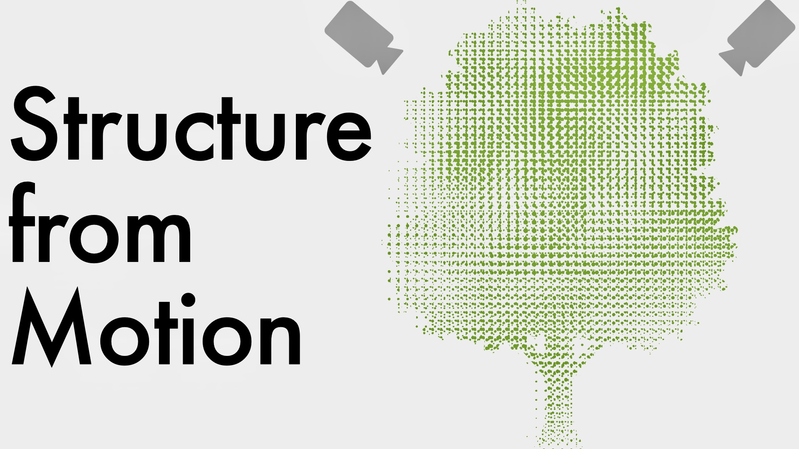
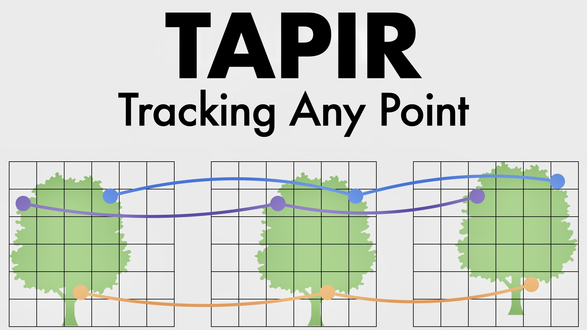
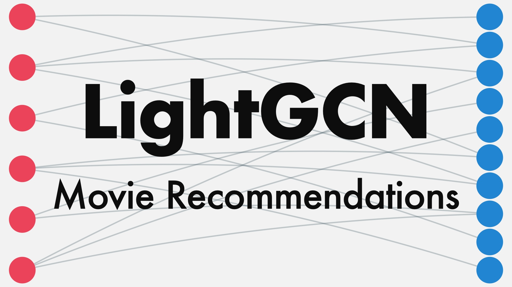
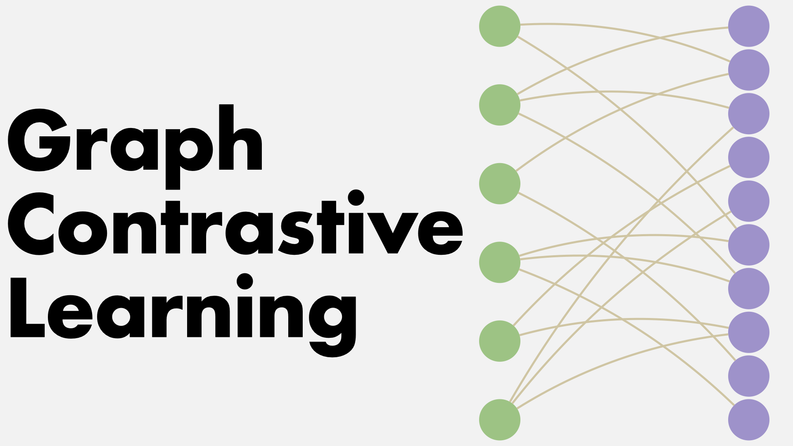

### Hi there 👋
### I'm Mashaan (مشعان)

I create [YouTube](https://youtube.com/@mashaan14) tutorials, and for each video, I also create a corresponding post featuring code snippets and figures related to the topic. You can find all of these posts in this repository, organized into the following sections:

* [Vision Transformers](#vision-transformers)
* [Swin Transformer](#swin-transformer)
* [Graph Neural Networks](#graph-neural-networks)
* [Self-Supervised Learning](#self-supervised-learning)
* [Neural Radiance Fields (NeRF)](#neural-radiance-fields-nerf)
* [Detection and Tracking](#detection-and-tracking)
* [Recommender Systems](#recommender-systems)
* [JAX Performance](#jax-performance)
* [Convolutional Neural Nets](#convolutional-neural-nets)
* [Spectral Clustering](#spectral-clustering)
* [Introduction to Neural Nets](#introduction-to-neural-nets)

## Vision Transformers
Vision Transformers implemented in PyTorch and JAX.

| Title | Code | Video |
|---|---|---|
| Vision Transformers (ViT): A JAX Tutorial for Image Classification | [code](https://mashaan14.github.io/YouTube-channel/vision_transformers/2024_03_28_jax_ViT) |  |
| Getting to Know MLP-Mixer: A CIFAR-10 Run | [code](https://mashaan14.github.io/YouTube-channel/vision_transformers/2025_03_17_MlpMixer) |  |
| Vision Transformers (ViT) pytorch code | [code](https://mashaan14.github.io/YouTube-channel/vision_transformers/2023_11_29_VisionTransformer_MNIST) |  |
| Fine-tuning Vision Transformers on TPU (ImageNet/CIFAR-10) | [code](https://mashaan14.github.io/YouTube-channel/vision_transformers/2025_02_17_vit_finetune) |  |
| MLP-Mixer in PyTorch: Google Gemini's Code Generation (Not Perfect!) | [code](https://mashaan14.github.io/YouTube-channel/vision_transformers/2025_03_24_MlpMixer_pytorch) |  |
| ViT vs CNN: A Comparative Experiment | [code](https://mashaan14.github.io/YouTube-channel/vision_transformers/2024_01_08_CNN_and_ViT) |  |

## Swin Transformer
Swin transformer code analysis and attention visualization.

|**Title**|**Code**|**Video**|
| :---: | :---: | :---: |
| Analyzing Swin Transformer: A Code Walkthrough | [code](https://mashaan14.github.io/YouTube-channel/swin_transformer/2024_08_19_swin_transformer_annotated) |  |
| A Deep Dive into Swin Transformer Attention Maps | [code](https://mashaan14.github.io/YouTube-channel/swin_transformer/2024_09_16_swin_transformer_attention) |  |

## Graph Neural Networks
Famous GNNs implemented in PyG, DGL, and jraph.

|**Title**|**Code**|**Video**|
| :---: | :---: | :---: |
| Graph Convolutional Networks (GCNs) in PyTorch | [code](https://mashaan14.github.io/YouTube-channel/graph_neural_networks/2023_12_04_GCN_introduction) |  |
| Graph Sampling for GNNs: A Tutorial | [code](https://mashaan14.github.io/YouTube-channel/graph_neural_networks/2024_05_27_GNN_sampling) |  |
| Understanding Mini-Batch Training in PyTorch Geometric | [code](https://mashaan14.github.io/YouTube-channel/graph_neural_networks/2024_04_29_GNN_mini_batch) |  |
| Graph Attention Networks with PyTorch Geometric | [code](https://mashaan14.github.io/YouTube-channel/graph_neural_networks/2024_02_05_GAT) |  |
| Graph Attention Networks with DGL | [code](https://mashaan14.github.io/YouTube-channel/graph_neural_networks/2024_05_13_DGL_GAT) |  |
| Graph Attention Networks with JAX | [code](https://mashaan14.github.io/YouTube-channel/graph_neural_networks/2024_03_18_jraph_GAT) |  |
| Implementing GNN Neighbor Sampler in JAX: A Practical Guide | [code](https://mashaan14.github.io/YouTube-channel/graph_neural_networks/2024_06_24_neighbor_sampler) |  |
| Building a Cluster-GCN Model with JAX: A Step-by-Step Guide | [code](https://mashaan14.github.io/YouTube-channel/graph_neural_networks/2024_07_15_ClusterGCN_jax) |  |
| Training GCNs with PyG and Jraph: A Side-by-Side Comparison | [code](https://mashaan14.github.io/YouTube-channel/graph_neural_networks/2024_03_21_jraph_GCN) |  |
| PyTorch code for GCN and SGC | [code](https://mashaan14.github.io/YouTube-channel/graph_neural_networks/2023_12_13_GCN_and_SGC) |  |
| GCN Variants: SGC and ASGC | [code](https://mashaan14.github.io/YouTube-channel/graph_neural_networks/2024_01_31_SGC_and_ASGC) |  |

## Self-Supervised Learning
Videos on Self-supervised learning (SSL) techniques, such as SimCLR, SwAV, iBOT, and DINOv2.

|**Title**|**Code**|**Video**|
| :---: | :---: | :---: |
| Inside DINOv2: Architecture Analysis + CIFAR-10 Experiment | [code](https://mashaan14.github.io/YouTube-channel/self_supervised_learning/2025_05_12_DINOv2) |  |

## Neural Radiance Fields (NeRF)
Videos about Neural Radiance Fields (NeRF) and Gaussian splatting.

|**Title**|**Code**|**Video**|
| :---: | :---: | :---: |
| VGG-SfM and Mip-NeRF 360 Pipeline for iPhone Video 3D Reconstruction | [code](https://mashaan14.github.io/YouTube-channel/nerf/2025_02_03_your_own_nerf) |  |
| Exploring Mip-NeRF 360: A Quick TPU Experiment | [code](https://mashaan14.github.io/YouTube-channel/nerf/2025_01_20_Replicate_Mip_NeRF_360) |  |
| Nerfstudio on Lightning AI (GPU Installation Tutorial) | [code](https://mashaan14.github.io/YouTube-channel/nerf/2025_01_14_nerfstudio_lightning_ai) |  |
| Structure from Motion (SfM): From COLMAP to VGGSfM | [code](https://mashaan14.github.io/YouTube-channel/nerf/2025_01_25_sfm) |  |
| How NeRF Works: Exploring a Tiny NeRF Code | [code](https://mashaan14.github.io/YouTube-channel/nerf/2024_11_25_nerf_notes) |  |
| 3D Gaussian Splatting: Optimization Explained & Viewer Demo | [code](https://mashaan14.github.io/YouTube-channel/nerf/2024_10_14_3DGS) |  |

## Detection and Tracking
Computer vision experiments exploring object detection and point tracking.

|**Title**|**Code**|**Video**|
| :---: | :---: | :---: |
| Hands-On with TAPIR: Point Tracking Experiment & Code Walkthrough | [code](https://mashaan14.github.io/YouTube-channel/detection_and_tracking/2025_03_03_TAPIR) |  |
| Experimenting Object Detection with DETR | [code](https://mashaan14.github.io/YouTube-channel/detection_and_tracking/2024_01_22_DETR_demo) |  |

## Recommender Systems
Videos exploring how to use graph neural networks to build recommender systems.

|**Title**|**Code**|**Video**|
| :---: | :---: | :---: |
| Exploring LightGCN: A Movie Recommendations Experiment | [code](https://mashaan14.github.io/YouTube-channel/recommender_systems/LightGCN_MovieLens) |  |
| Graph Contrastive Learning: Building MovieLens-100k Recommendations | [code](https://mashaan14.github.io/YouTube-channel/recommender_systems/SimGCL_MovieLens) |  |

## JAX Performance
Videos about how to get free TPUs through Google's TPU Research Cloud and JAX JIT compilation (Python to JAXPR) for maximum speed.

|**Title**|**Code**|**Video**|
| :---: | :---: | :---: |
| Free TPU Access & JAX/PyTorch Setup with TPU Research Cloud | [code](https://mashaan14.github.io/YouTube-channel/jax_performance/2024_11_11_tpu_test) |  |
| JAX JIT Compilation Explained: From Python to JAXPR | [code](https://mashaan14.github.io/YouTube-channel/jax_performance/2024_04_14_jax_speed_test) |  |

## Convolutional Neural Nets
Convolutional Neural Nets implemented in PyTorch and JAX.

|**Title**|**Code**|**Video**|
| :---: | :---: | :---: |
| PyTorch Conv2d Explained | [code](https://mashaan14.github.io/YouTube-channel/convolutional_neural_nets/2024_01_29_Conv2d) |  |
| JAX Conv Layer Explained | [code](https://mashaan14.github.io/YouTube-channel/convolutional_neural_nets/2024_03_07_jax_conv) |  |
| CNNs with Flax: A JAX Tutorial for Image Classification | [code](https://mashaan14.github.io/YouTube-channel/convolutional_neural_nets/2024_04_02_jax_CNN) |  |

## Spectral Clustering
Code walkthroughs for spectral clustering and sparse subspace clustering.

|**Title**|**Code**|**Video**|
| :---: | :---: | :---: |
| A Step-by-Step Guide to Spectral Clustering | [code](https://mashaan14.github.io/YouTube-channel/spectral_clustering/2024_01_15_spectral_clustering) |  |
| Exploring Sparse Subspace Clustering: Theory and Practice | [code](https://mashaan14.github.io/YouTube-channel/spectral_clustering/2024_02_13_SSC) |  |

## Introduction to Neural Nets
This playlist covers fundamental neural network concepts blending theory and practical coding.

|**Title**|**Code**|**Video**|
| :---: | :---: | :---: |
| JAX and Flax: A Simple Neural Network | [code](https://mashaan14.github.io/YouTube-channel/introduction_to_neural_nets/2024_02_28_jax_three_layer_NN) |  |
| Simple Neural Net in PyTorch | [code](https://mashaan14.github.io/YouTube-channel/introduction_to_neural_nets/2023_12_17_three_layer_NN) |  |
| RBF: The Most Liked Formula in Machine Learning | [code](https://mashaan14.github.io/YouTube-channel/introduction_to_neural_nets/2024_12_09_squared_exponential) |  |
| The Perceptron: A Building Block of Neural Networks | [code](https://mashaan14.github.io/YouTube-channel/introduction_to_neural_nets/2023_12_10_SGD_Perceptron) |  |
