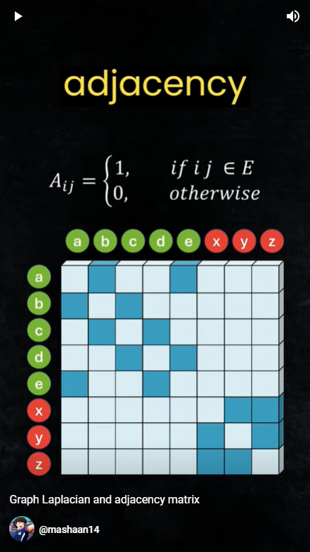

# mashaan14 YouTube channel
I casually post videos to [my YouTube channel](https://youtube.com/@mashaan14). Here are the notebooks I used to produce the figures for my videos.

| Title |&nbsp;|&nbsp;|
| :--- | :---: | :---: | :---: |
| covariance matrix in diffusion models | [video](https://youtube.com/shorts/4jYY0b52NIQ?feature=share) | [code](https://github.com/mashaan14/YouTube-channel/blob/main/2023_11_02_covariance_in_diffusion.ipynb) | &nbsp; |
| Connecting points for KwikBucks clustering | [video](https://youtube.com/shorts/Sl93IlD_1VU?feature=share) | [code](https://github.com/mashaan14/YouTube-channel/blob/main/2023_11_07_graph_construction.ipynb) | &nbsp; |
| positional encoding in transformers | [video](https://youtube.com/shorts/T6N1v7NyeS4?feature=share) | [code](https://github.com/mashaan14/YouTube-channel/blob/main/2023_11_10_positional_encoding.ipynb) | &nbsp; |
| Graph Laplacian and adjacency matrix | [video](https://youtube.com/shorts/jr93FHW1krg?feature=share) | [code](https://github.com/mashaan14/YouTube-channel/blob/main/2023_11_12_graph_Laplacian.ipynb) |  |
| seaborn plots | [video](https://youtu.be/uI6w_lEVZCs) | [code](https://github.com/mashaan14/YouTube-channel/blob/main/2023_11_13_seaborn_plots.ipynb) | &nbsp; |
