# Mashaan's YouTube channel
For each [YouTube](https://youtube.com/@mashaan14) video I post, I create a corresponding Jupyter notebook or Markdown file. You can find them all in this repository, organized into the following sections:

* [Vision Transformers](#vision-transformers)
* [Swin Transformer](#swin-transformer)
* [Neural Radiance Fields (NeRF)](#neural-radiance-fields-nerf)
* [Graph Neural Networks](#graph-neural-networks)
* [JAX Performance](#jax-performance)
* [Convolutional Neural Nets](#convolutional-neural-nets)
* [Spectral Clustering](#spectral-clustering)
* [Introduction to Neural Nets](#introduction-to-neural-nets)

## Vision Transformers
Vision Transformers implemented in PyTorch and JAX.
|**Title**|**Code**|**Video**|
| :---: | :---: | :---: |
| Vision Transformers (ViT): A JAX Tutorial for Image Classification | [code](https://github.com/mashaan14/YouTube-channel/blob/main/notebooks/2024_03_28_jax_ViT.ipynb) |  |
| Vision Transformers (ViT) pytorch code | [code](https://github.com/mashaan14/VisionTransformer-MNIST/blob/main/VisionTransformer_MNIST.ipynb) | [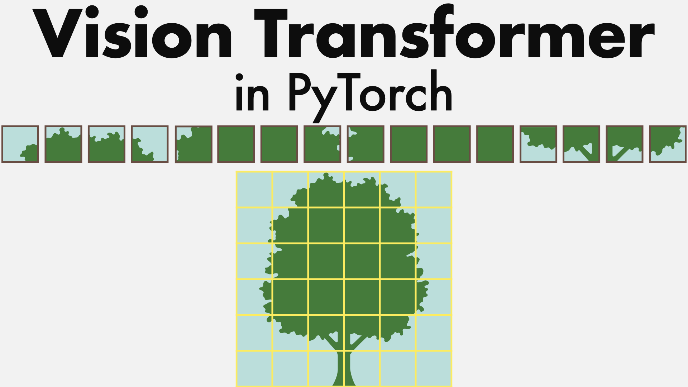](https://youtu.be/y1ZmMcMYjkY) |
| ViT vs CNN: A Comparative Experiment | [code](https://github.com/mashaan14/YouTube-channel/blob/main/notebooks/2024_01_08_CNN_and_ViT.ipynb) | [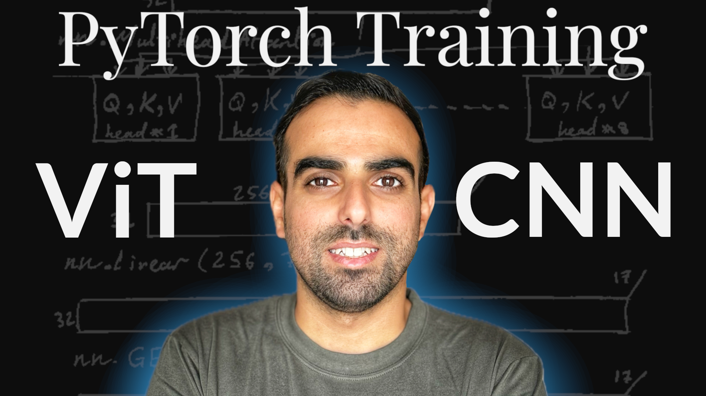](https://youtu.be/uggBVJebdcY) |
| Experimenting Object Detection with DETR | [code](https://github.com/mashaan14/YouTube-channel/blob/main/notebooks/2024_01_22_DETR_demo.ipynb) | [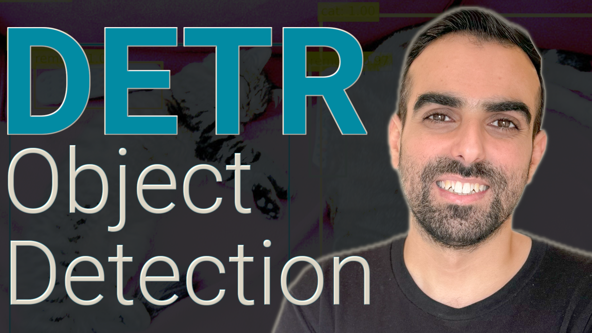](https://youtu.be/Z3fXiV4Cmz4) |

## Swin Transformer
Swin transformer code analysis and attention visualization.
|**Title**|**Code**|**Video**|
| :---: | :---: | :---: |
| Analyzing Swin Transformer: A Code Walkthrough | [code](https://github.com/mashaan14/YouTube-channel/blob/main/notebooks/2024_08_19_swin_transformer_annotated.ipynb) | [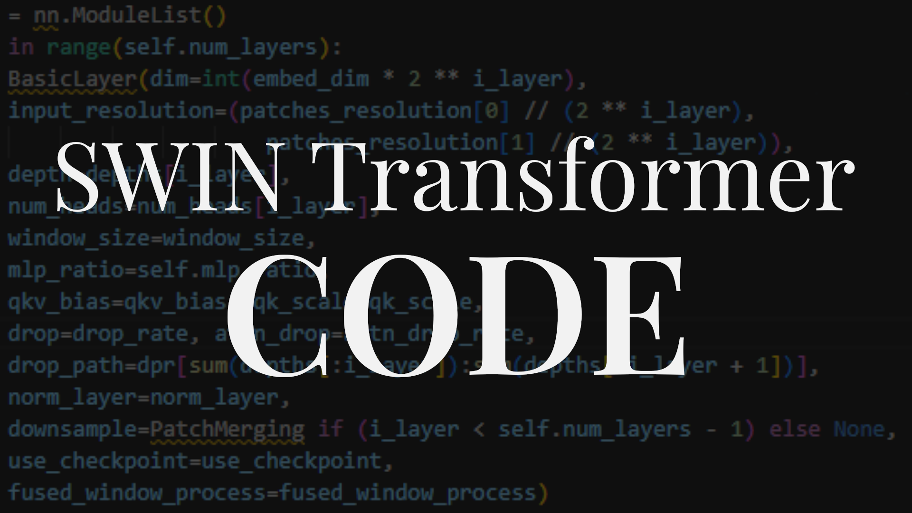](https://youtu.be/LspWysWparE) |
| A Deep Dive into Swin Transformer Attention Maps | [code](https://github.com/mashaan14/YouTube-channel/blob/main/notebooks/2024_09_16_swin_transformer_attention.ipynb) | [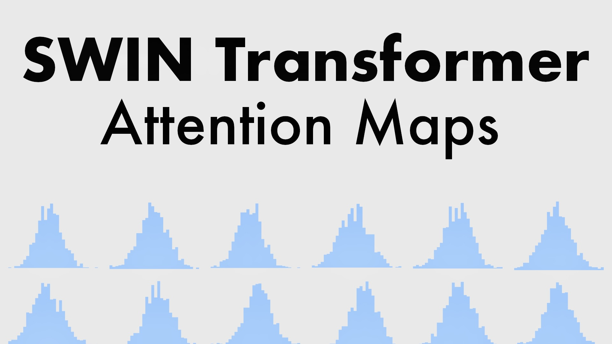](https://youtu.be/mtCTIGgzfbc) |

## Neural Radiance Fields (NeRF)
Videos about Neural Radiance Fields (NeRF) and Gaussian splatting.
|**Title**|**Code**|**Video**|
| :---: | :---: | :---: |
| How NeRF Works: Exploring a Tiny NeRF Code | [code](https://github.com/mashaan14/YouTube-channel/blob/main/notebooks/2024_11_25_nerf_notes.ipynb) | [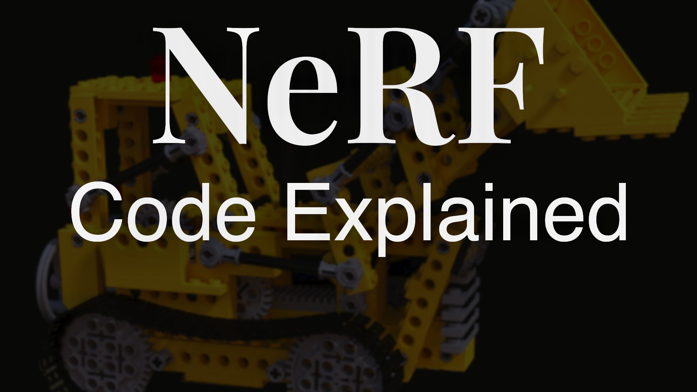](https://youtu.be/kszswpg7sjs) |
| 3D Gaussian Splatting: Optimization Explained & Viewer Demo | [code](https://github.com/mashaan14/YouTube-channel/blob/main/notebooks/2024_10_14_3DGS.ipynb) | [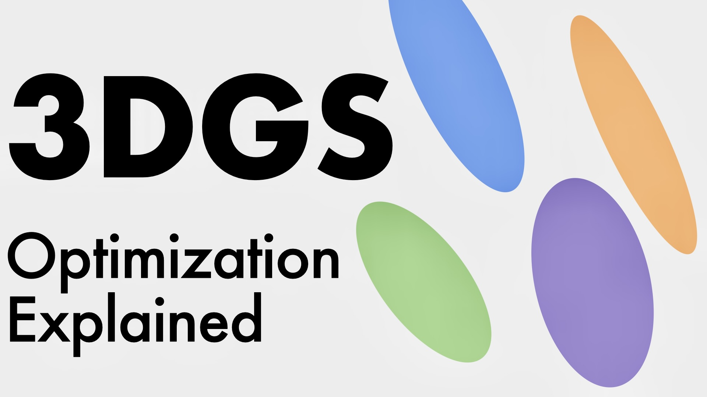](https://youtu.be/hGToeFGX-2M) |
| Nerfstudio on Lightning AI (GPU Installation Tutorial) | [code](https://github.com/mashaan14/YouTube-channel/blob/main/notebooks/2025_01_14_nerfstudio_lightning_ai.md) | [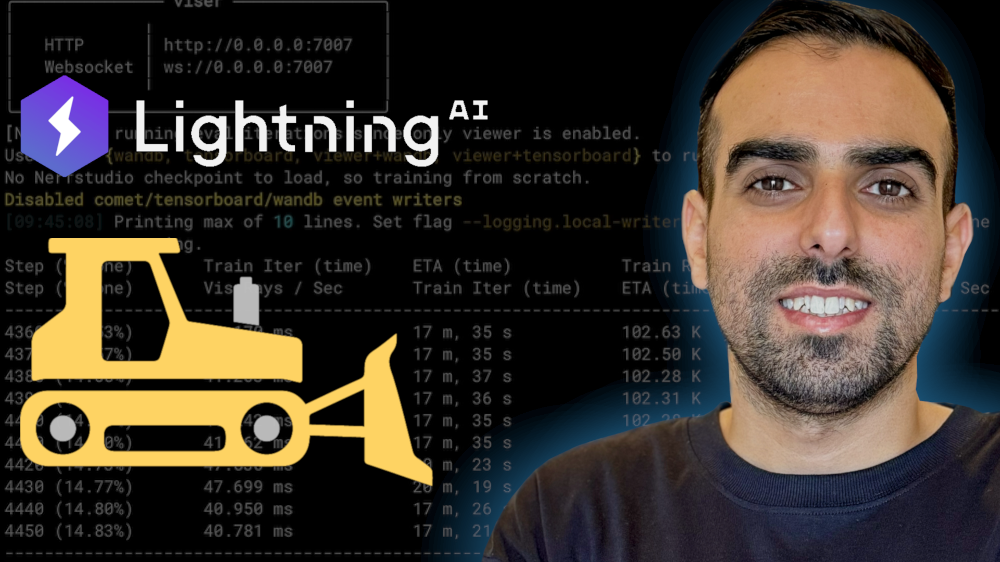](https://youtu.be/cgTYkjKL1b0) |

## Graph Neural Networks
Famous GNNs implemented in PyG, DGL, and jraph.
|**Title**|**Code**|**Video**|
| :---: | :---: | :---: |
| Graph Convolutional Networks (GCNs) in PyTorch | [code](https://github.com/mashaan14/YouTube-channel/blob/main/notebooks/2023_12_04_GCN_introduction.ipynb) | [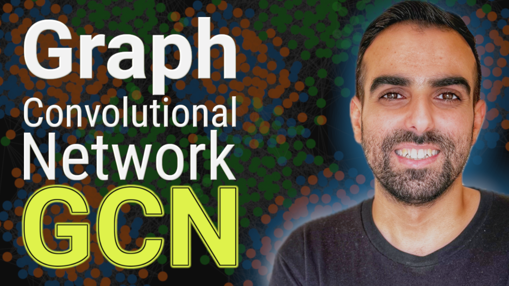](https://youtu.be/G6c6zk0RhRM) |
| Graph Sampling for GNNs: A Tutorial | [code](https://github.com/mashaan14/YouTube-channel/blob/main/notebooks/2024_05_27_GNN_sampling.ipynb) | [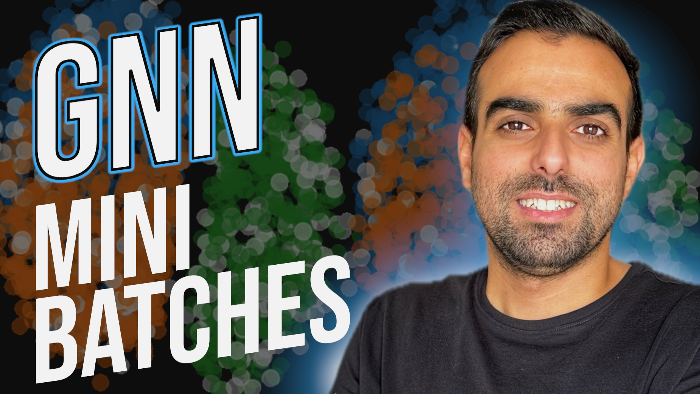](https://youtu.be/y0poBC8xN1k) |
| Understanding Mini-Batch Training in PyTorch Geometric | [code](https://github.com/mashaan14/YouTube-channel/blob/main/notebooks/2024_04_29_GNN_mini_batch.ipynb) | [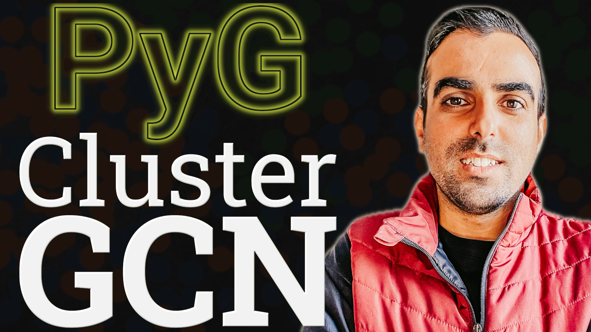](https://youtu.be/ZfCtFLS_os0) |
| Graph Attention Networks with PyTorch Geometric | [code](https://github.com/mashaan14/YouTube-channel/blob/main/notebooks/2024_02_05_GAT.ipynb) | [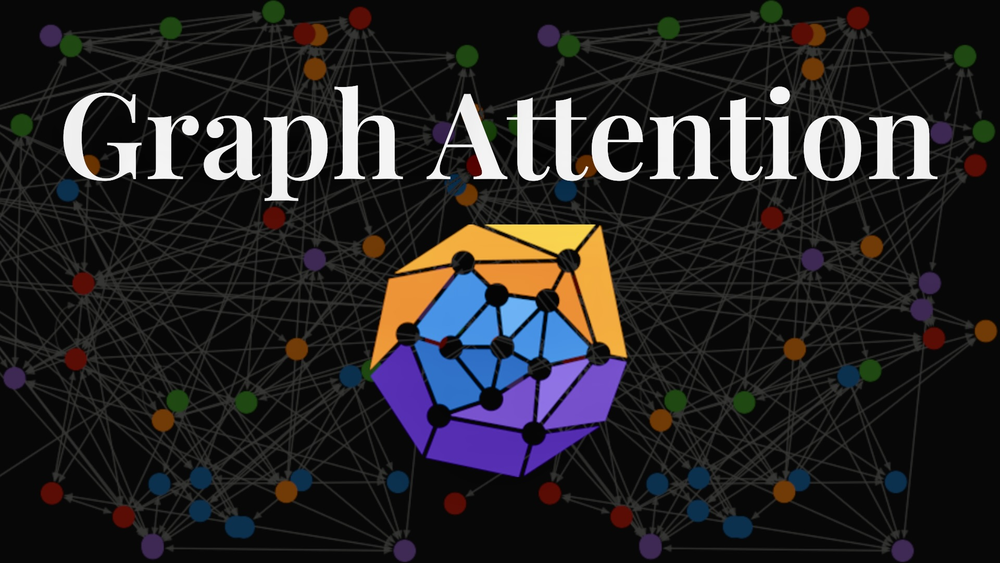](https://youtu.be/AWkPjrZshug) |
| Graph Attention Networks with DGL | [code](https://github.com/mashaan14/YouTube-channel/blob/main/notebooks/2024_05_13_DGL_GAT.ipynb) | [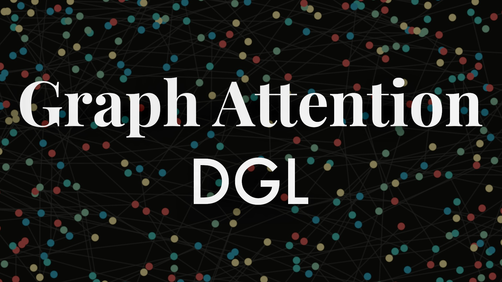](https://youtu.be/-V-T7koEWig) |
| Graph Attention Networks with JAX | [code](https://github.com/mashaan14/YouTube-channel/blob/main/notebooks/2024_03_18_jraph_GAT.ipynb) | [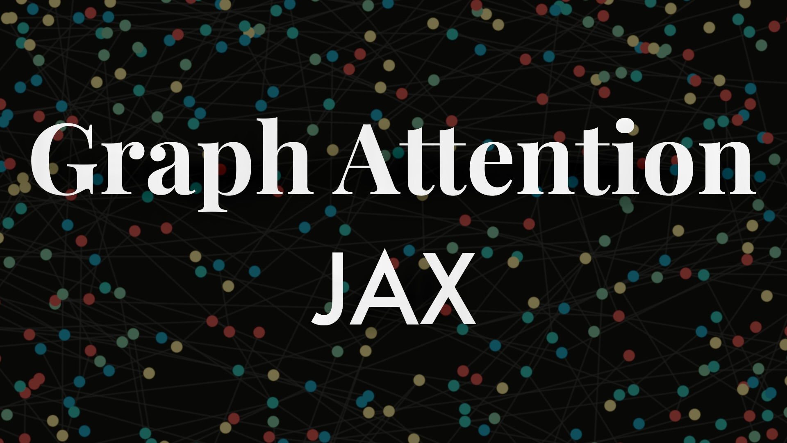](https://youtu.be/O1zGWMEgW7A) |
| Implementing GNN Neighbor Sampler in JAX: A Practical Guide | [code](https://github.com/mashaan14/YouTube-channel/blob/main/notebooks/2024_06_24_neighbor_sampler.ipynb) |  |
| Building a Cluster-GCN Model with JAX: A Step-by-Step Guide | [code](https://github.com/mashaan14/YouTube-channel/blob/main/notebooks/2024_07_15_ClusterGCN_jax.ipynb) | [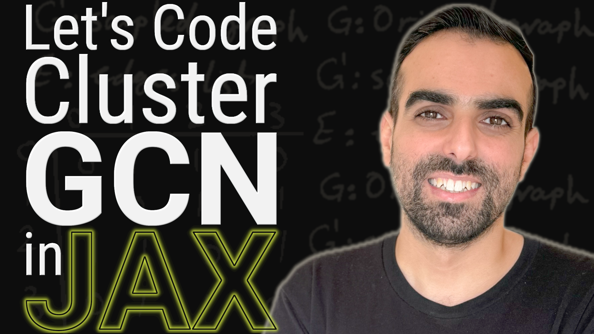](https://youtu.be/8mknbxIIf94) |
| Training GCNs with PyG and Jraph: A Side-by-Side Comparison | [code](https://github.com/mashaan14/YouTube-channel/blob/main/notebooks/2024_03_21_jraph_GCN.ipynb) | [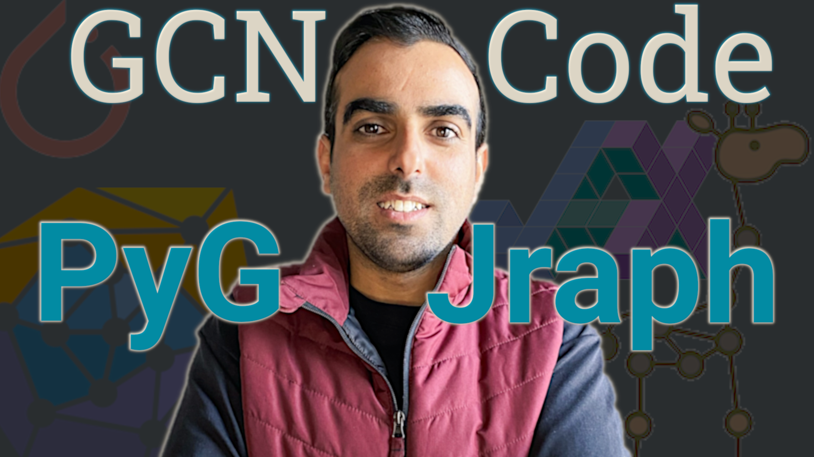](https://youtu.be/W-JDqd5AFio) |
| PyTorch code for GCN and SGC | [code](https://github.com/mashaan14/YouTube-channel/blob/main/notebooks/2023_12_13_GCN_and_SGC.ipynb) | [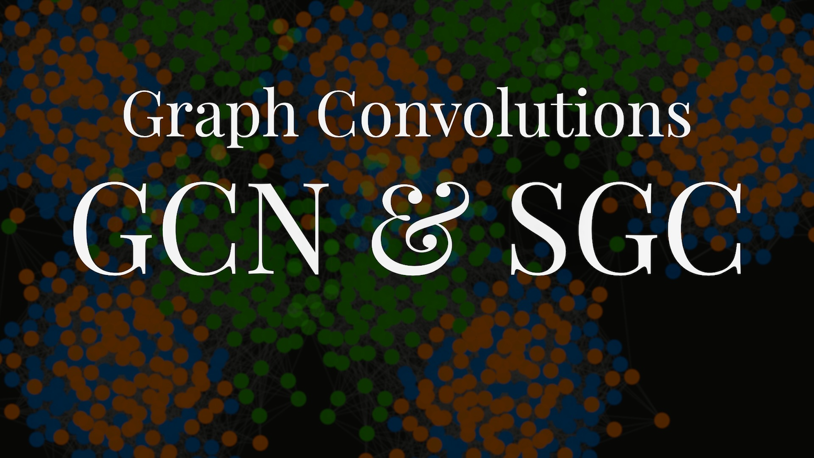](https://youtu.be/PQT2QblNegY) |
| GCN Variants: SGC and ASGC | [code](https://github.com/mashaan14/YouTube-channel/blob/main/notebooks/2024_01_31_SGC_and_ASGC.ipynb) | [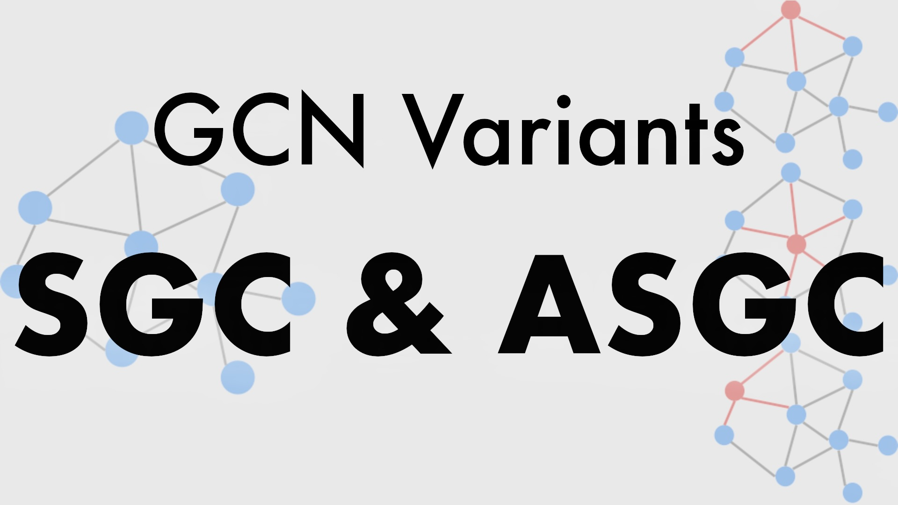](https://youtu.be/ZNMV5i84fmM) |

## JAX Performance
Videos about how to get free TPUs through Google's TPU Research Cloud and JAX JIT compilation (Python to JAXPR) for maximum speed.
|**Title**|**Code**|**Video**|
| :---: | :---: | :---: |
| Free TPU Access & JAX/PyTorch Setup with TPU Research Cloud | [code](https://github.com/mashaan14/YouTube-channel/blob/main/notebooks/2024_11_11_tpu_test.md) |  |
| JAX JIT Compilation Explained: From Python to JAXPR | [code](https://github.com/mashaan14/YouTube-channel/blob/main/notebooks/2024_04_14_jax_speed_test.ipynb) |  |

## Convolutional Neural Nets
Convolutional Neural Nets implemented in PyTorch and JAX.
|**Title**|**Code**|**Video**|
| :---: | :---: | :---: |
| PyTorch Conv2d Explained | [code](https://github.com/mashaan14/YouTube-channel/blob/main/notebooks/2024_01_29_Conv2d.ipynb) | [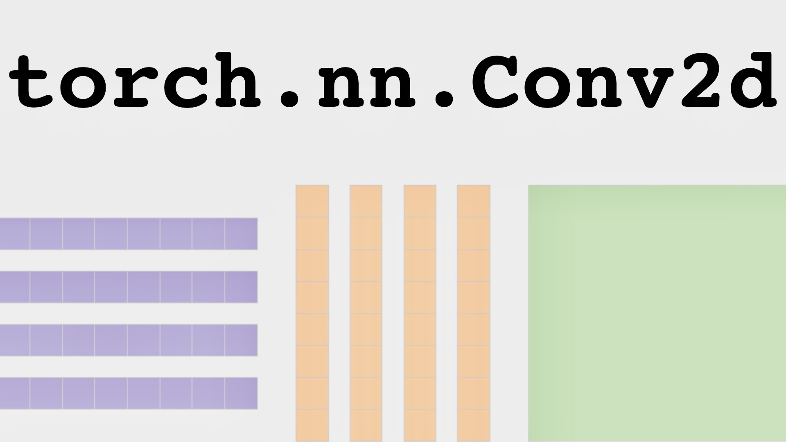](https://youtu.be/j19Wdlu7Rtg) |
| JAX Conv Layer Explained | [code](https://github.com/mashaan14/YouTube-channel/blob/main/notebooks/2024_03_07_jax_conv.ipynb) |  |
| CNNs with Flax: A JAX Tutorial for Image Classification | [code](https://github.com/mashaan14/YouTube-channel/blob/main/notebooks/2024_04_02_jax_CNN.ipynb) | [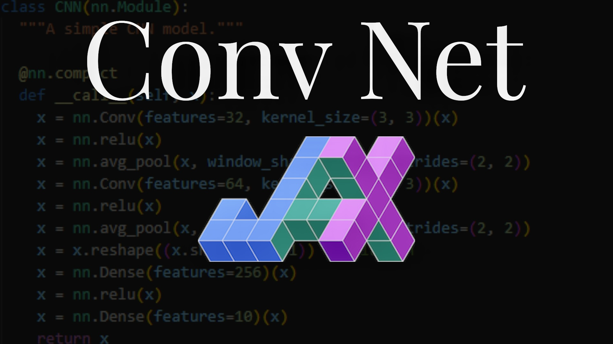](https://youtu.be/Q0vvh95wes8) |

## Spectral Clustering
Code walkthroughs for spectral clustering and sparse subspace clustering.
|**Title**|**Code**|**Video**|
| :---: | :---: | :---: |
| A Step-by-Step Guide to Spectral Clustering | [code](https://github.com/mashaan14/YouTube-channel/blob/main/spectral_clustering/2024_01_15_spectral_clustering.ipynb) | [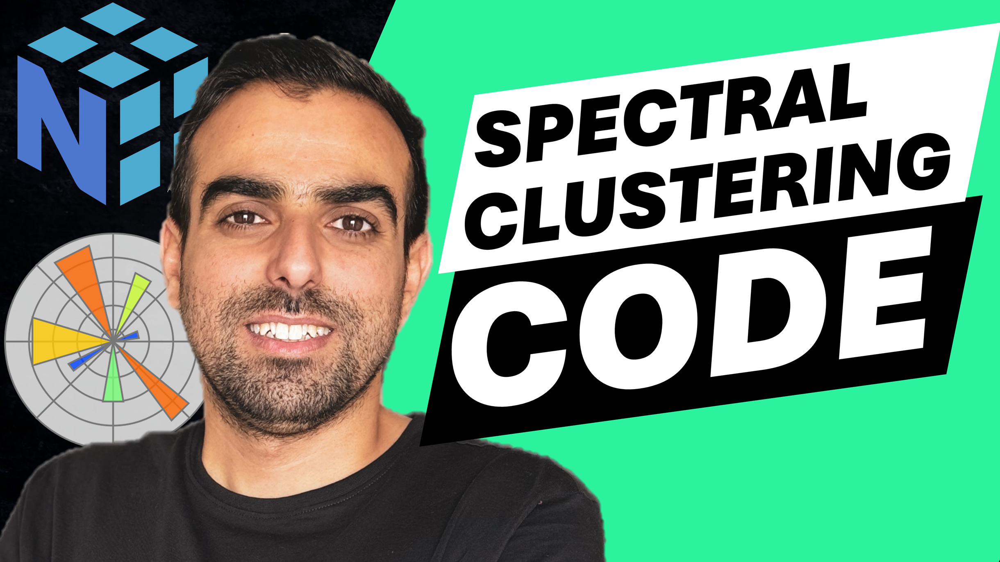](https://youtu.be/k7M1TMYac-Y) |
| Exploring Sparse Subspace Clustering: Theory and Practice | [code](https://github.com/mashaan14/YouTube-channel/blob/main/spectral_clustering/2024_02_13_SSC.ipynb) | [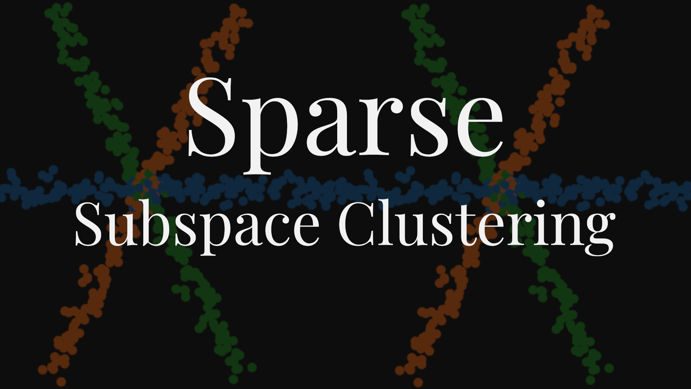](https://youtu.be/xUmO_S7lLG8) |

## Introduction to Neural Nets
This playlist covers fundamental neural network concepts blending theory and practical coding.
|**Title**|**Code**|**Video**|
| :---: | :---: | :---: |
| JAX and Flax: A Simple Neural Network | [code](https://github.com/mashaan14/YouTube-channel/blob/main/introduction_to_neural_nets/2024_02_28_jax_three_layer_NN.ipynb) | [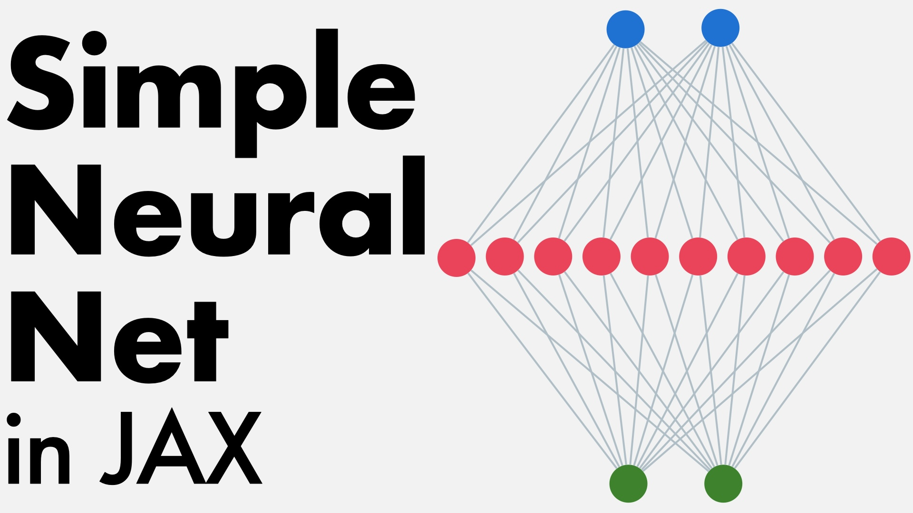](https://youtu.be/GNLOa4riys8) |
| Simple Neural Net in PyTorch | [code](https://github.com/mashaan14/YouTube-channel/blob/main/introduction_to_neural_nets/2023_12_17_three_layer_NN.ipynb) | [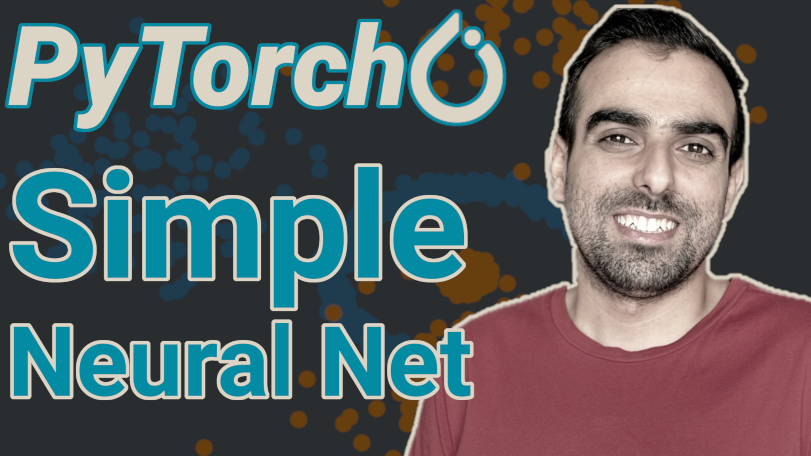](https://youtu.be/SQfTaOR8ApQ) |
| RBF: The Most Liked Formula in Machine Learning | [code](https://github.com/mashaan14/YouTube-channel/blob/main/introduction_to_neural_nets/2024_12_09_squared_exponential.ipynb) | [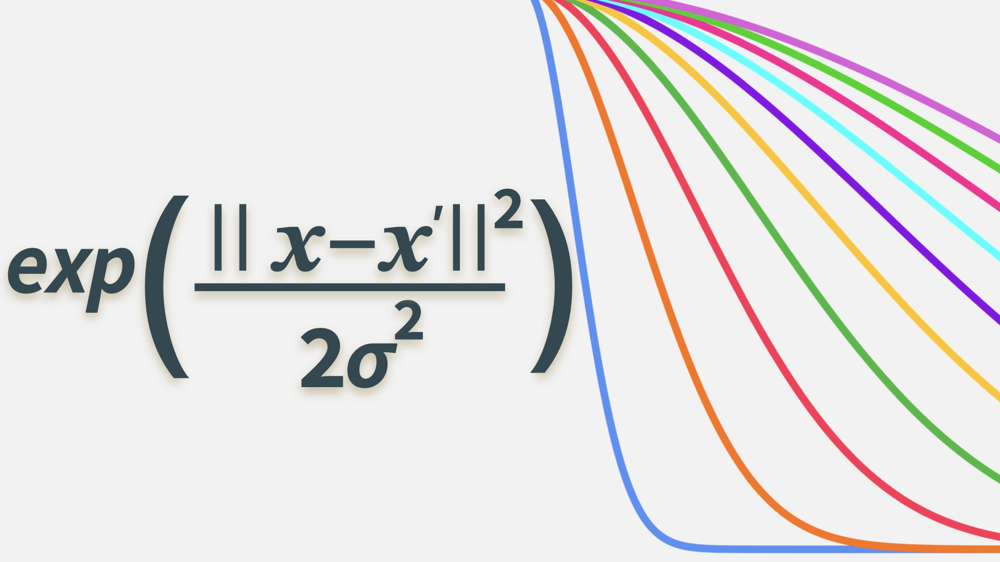](https://youtu.be/H4S3QAoMEEo) |
| The Perceptron: A Building Block of Neural Networks | [code](https://github.com/mashaan14/YouTube-channel/blob/main/introduction_to_neural_nets/2023_12_10_SGD_Perceptron.ipynb) | [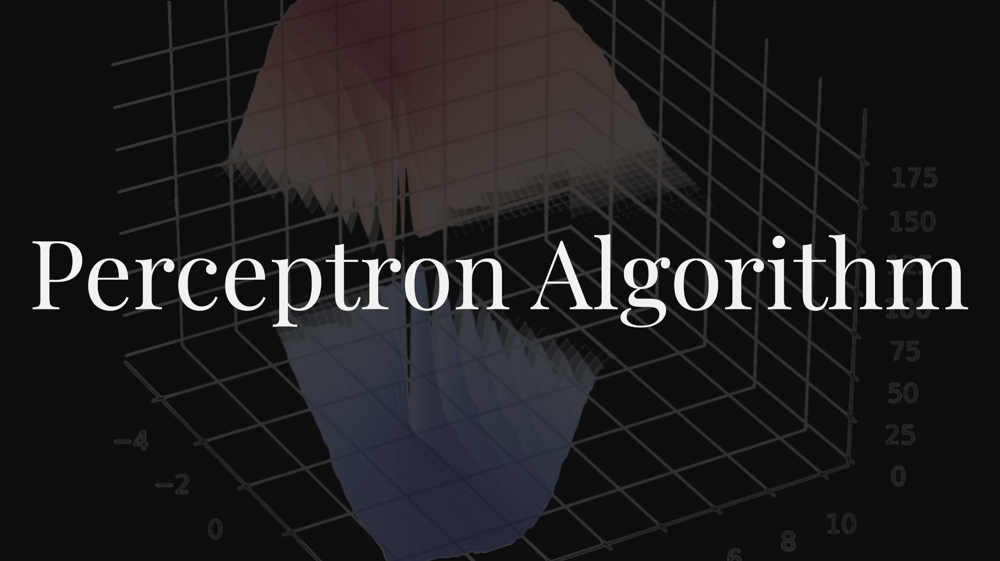](https://youtu.be/RjJH_r5CXBU) |
