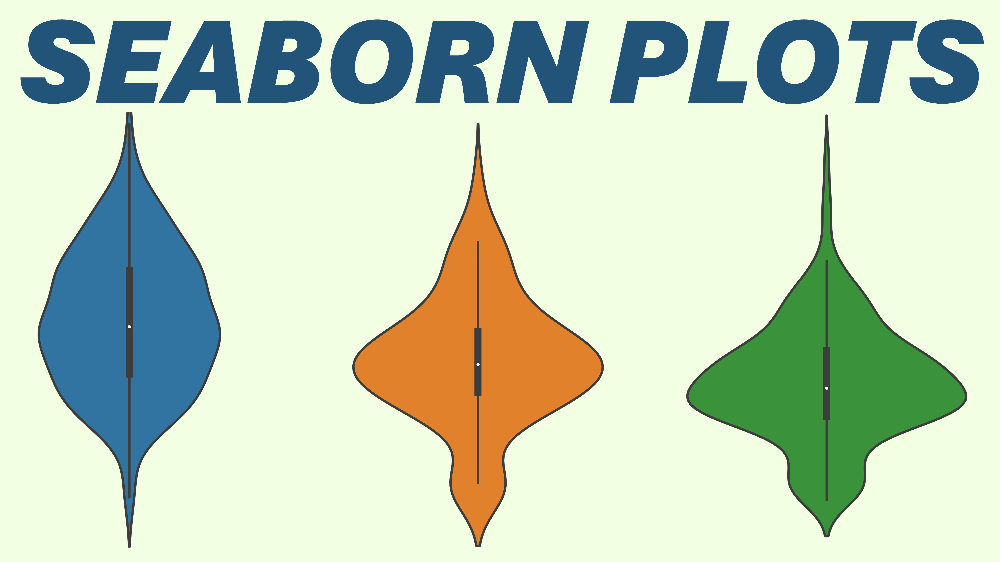
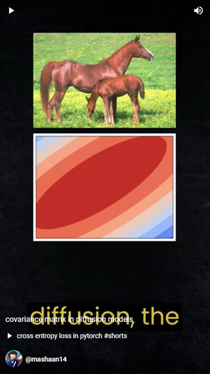
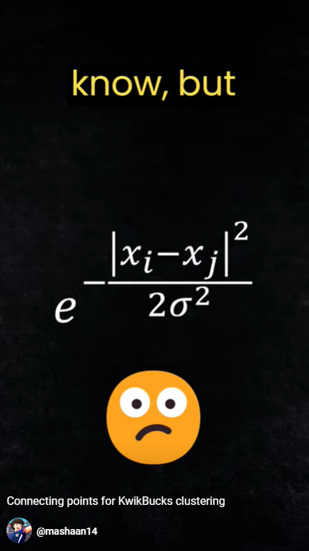
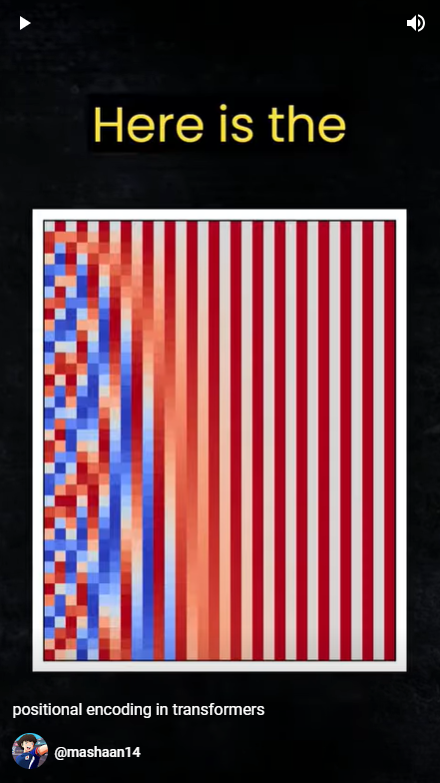
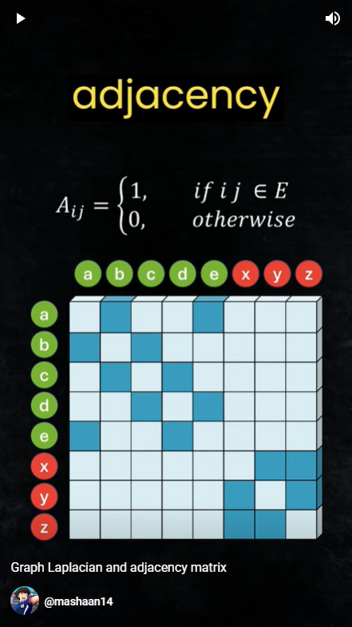
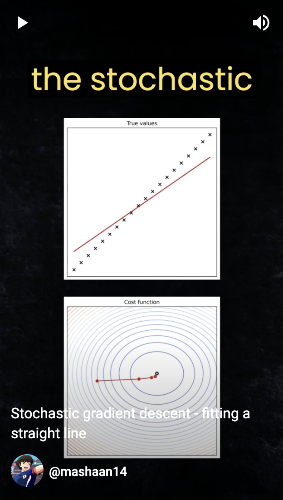
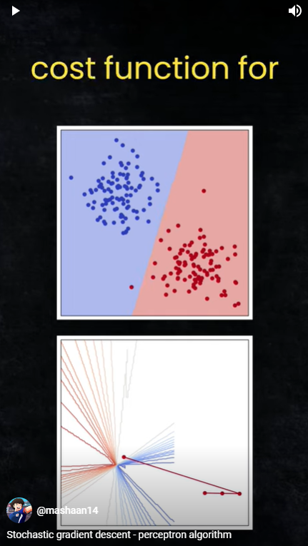
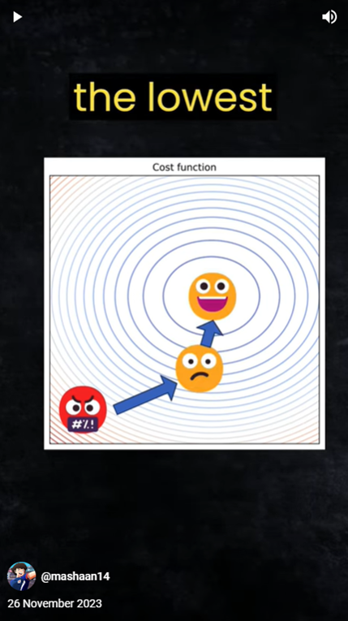
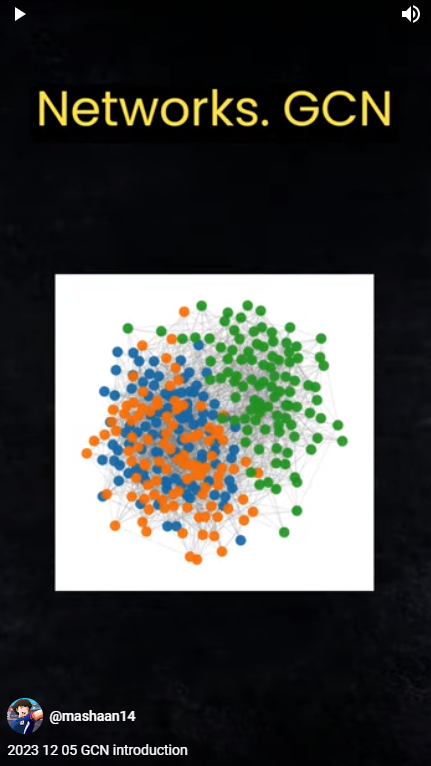

# [Mashaan's](https://youtube.com/@mashaan14) YouTube channel
Here are the notebooks I used in my [YouTube](https://youtube.com/@mashaan14) videos.

|&nbsp;|&nbsp;|&nbsp;|
| :---: | :---: | :---: |
| Graph Attention Networks in JAX | [code](https://github.com/mashaan14/YouTube-channel/blob/main/notebooks/2024_03_18_jraph_GAT.ipynb) |  |
| Convolutional Layers in JAX | [code](https://github.com/mashaan14/YouTube-channel/blob/main/notebooks/2024_03_07_jax_conv.ipynb) |  |
| Simple Neural Net in JAX | [code](https://github.com/mashaan14/YouTube-channel/blob/main/notebooks/2024_02_28_jax_three_layer_NN.ipynb) |  |
| GCN code for PyTorch Geometric and Jraph | [code](https://github.com/mashaan14/YouTube-channel/blob/main/notebooks/2024_02_20_jraph.ipynb) |  |
| Sparse Subspace Clustering (SSC) | [code](https://github.com/mashaan14/YouTube-channel/blob/main/notebooks/2024_02_13_SSC.ipynb) |  |
| Graph Attention in PyTorch Geometric | [code](https://github.com/mashaan14/YouTube-channel/blob/main/notebooks/2024_02_05_GAT.ipynb) |  |
| PyTorch Conv2d Under The Hood | [code](https://github.com/mashaan14/YouTube-channel/blob/main/notebooks/2024_01_29_Conv2d.ipynb) |  |
| GCN Variants: SGC and ASGC | [code](https://github.com/mashaan14/YouTube-channel/blob/main/notebooks/2024_01_31_SGC_and_ASGC.ipynb) |  |
| DETR Object Detection | [code](https://github.com/mashaan14/YouTube-channel/blob/main/notebooks/2024_01_22_DETR_demo.ipynb) |  |
| Spectral Clustering Code | [code](https://github.com/mashaan14/YouTube-channel/blob/main/notebooks/2024_01_15_spectral_clustering.ipynb) |  |
| CNN vs ViT: PyTorch Training | [code](https://github.com/mashaan14/YouTube-channel/blob/main/notebooks/2024_01_08_CNN_and_ViT.ipynb) |  |
| Multilayer Neural Networks Code | [code](https://github.com/mashaan14/YouTube-channel/blob/main/notebooks/2023_12_17_three_layer_NN.ipynb) |  |
| PyTorch code for GCN and SGC | [code](https://github.com/mashaan14/YouTube-channel/blob/main/notebooks/2023_12_13_GCN_and_SGC.ipynb) |  |
| Perceptron Algorithm Code | [code](https://github.com/mashaan14/YouTube-channel/blob/main/notebooks/2023_12_10_SGD_Perceptron.ipynb) |  |
| Graph Convolutional Networks (GCNs) in PyTorch | [code](https://github.com/mashaan14/YouTube-channel/blob/main/notebooks/2023_12_04_GCN_introduction.ipynb) |  |
| Attention maps in vision transformers (ViT) | [code](https://github.com/mashaan14/VisionTransformer-MNIST/blob/main/VisionTransformer_MNIST.ipynb) |  |
| Seaborn plots | [code](https://github.com/mashaan14/YouTube-channel/blob/main/notebooks/2023_11_13_seaborn_plots.ipynb) |  |

<!---
## Shorts
|&nbsp;|&nbsp;|&nbsp;|
| :---: | :---: | :---: |
|  |  |  |
| Covariance matrix in diffusion models | Connecting points for KwikBucks clustering | Positional encoding in transformers |
| [code](https://github.com/mashaan14/YouTube-channel/blob/main/notebooks/2023_11_02_covariance_in_diffusion.ipynb) | [code](https://github.com/mashaan14/YouTube-channel/blob/main/notebooks/2023_11_07_graph_construction.ipynb) | [code](https://github.com/mashaan14/YouTube-channel/blob/main/notebooks/2023_11_10_positional_encoding.ipynb) |
|  |  |  |
| Graph Laplacian and adjacency matrix | Stochastic gradient descent - fitting a straight line |Stochastic gradient descent - perceptron algorithm |
| [code](https://github.com/mashaan14/YouTube-channel/blob/main/notebooks/2023_11_12_graph_Laplacian.ipynb) | [code](https://github.com/mashaan14/YouTube-channel/blob/main/notebooks/2023_11_17_SGD_line.ipynb) | [code](https://github.com/mashaan14/YouTube-channel/blob/main/notebooks/2023_12_10_SGD_Perceptron.ipynb) |
|  |  |&nbsp;|
| Stochastic gradient descent - why zero_grad in pytorch?|Graph Convolutional Networks (GCNs)|&nbsp;|
| [code](https://github.com/mashaan14/YouTube-channel/blob/main/notebooks/2023_11_17_SGD_line.ipynb) | [code](https://github.com/mashaan14/YouTube-channel/blob/main/notebooks/2023_12_04_GCN_introduction.ipynb) |&nbsp;|
-->
