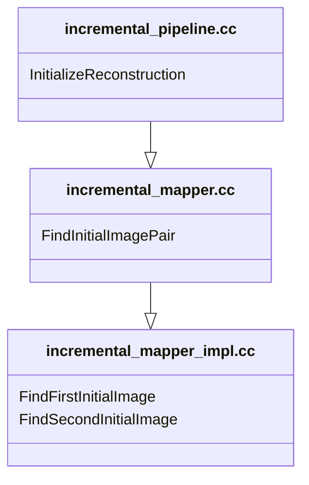
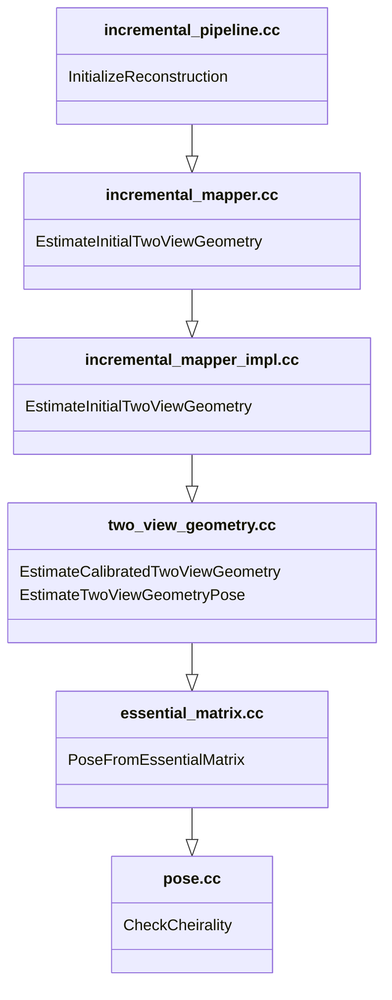

# Structure-from-Motion (SfM): A Tutorial

## SfM initialization in colmap
### Choosing the initial pair of images

these notes were taken from:
https://github.com/colmap/colmap/blob/cb02ca13a57e565c6bfb56f5f88d65dab222cd7b/src/colmap/sfm/incremental_mapper_impl.h

Colmap implements an incremental SfM using three files:
* [incremental_pipeline.cc](https://github.com/colmap/colmap/blob/cb02ca13a57e565c6bfb56f5f88d65dab222cd7b/src/colmap/controllers/incremental_pipeline.cc) under  `colmap/src/colmap/controllers/incremental_pipeline.cc`.
* [incremental_mapper.cc](https://github.com/colmap/colmap/blob/cb02ca13a57e565c6bfb56f5f88d65dab222cd7b/src/colmap/sfm/incremental_mapper.cc) under `colmap/src/colmap/sfm/incremental_mapper.cc`.
* [incremental_mapper_impl.cc](https://github.com/colmap/colmap/blob/cb02ca13a57e565c6bfb56f5f88d65dab222cd7b/src/colmap/sfm/incremental_mapper_impl.cc) under `colmap/src/colmap/sfm/incremental_mapper_impl.cc`.


The function `InitializeReconstruction` inside `colmap/src/colmap/controllers/incremental_pipeline.cc` initializes the reconstruction by calling `FindInitialImagePair` in `colmap/src/colmap/sfm/incremental_mapper.cc`


* `FindFirstInitialImage`: It finds a first image by sorting all images in a way that priortizes images with a large number of correspondences and have camera calibration priors.
* `FindSecondInitialImage`: It orders images in a list where it places at top of the list the images with large number of correspondences to the first image and have camera calibration priors.

Large number of correspondences would make it easy to pair it with a second image, and having camera calibration priors would allow colmap to use the essential matrix $E$ to estimate the camera poses.

### Estimating two view geometry between the initial pair
In addition to [incremental_pipeline.cc](https://github.com/colmap/colmap/blob/cb02ca13a57e565c6bfb56f5f88d65dab222cd7b/src/colmap/controllers/incremental_pipeline.cc), [incremental_mapper.cc](https://github.com/colmap/colmap/blob/cb02ca13a57e565c6bfb56f5f88d65dab222cd7b/src/colmap/sfm/incremental_mapper.cc), and [incremental_mapper_impl.cc](https://github.com/colmap/colmap/blob/cb02ca13a57e565c6bfb56f5f88d65dab222cd7b/src/colmap/sfm/incremental_mapper_impl.cc) we have two more files to estimate two view geometry between the initial pair of images:

* [two_view_geometry.cc](https://github.com/colmap/colmap/blob/cb02ca13a57e565c6bfb56f5f88d65dab222cd7b/src/colmap/estimators/two_view_geometry.cc) under `colmap/src/colmap/estimators/two_view_geometry.cc`.
* [essential_matrix.cc](https://github.com/colmap/colmap/blob/cb02ca13a57e565c6bfb56f5f88d65dab222cd7b/src/colmap/geometry/essential_matrix.cc) under `colmap/src/colmap/geometry/essential_matrix.cc`.
* [pose.cc](https://github.com/colmap/colmap/blob/cb02ca13a57e565c6bfb56f5f88d65dab222cd7b/src/colmap/geometry/pose.cc) under `colmap/src/colmap/geometry/pose.cc`.



* `EstimateCalibratedTwoViewGeometry`: estimates two-view geometry from calibrated image pair. 
  * Extract corresponding points
  * Estimate epipolar models
  * Estimate planar or panoramic model
  * Determine inlier ratios of different models
* `EstimateTwoViewGeometryPose`: estimates relative pose for two-view geometry.
```cc
  // Try to recover relative pose for calibrated and uncalibrated
  // configurations. In the uncalibrated case, this most likely leads to a
  // ill-defined reconstruction, but sometimes it succeeds anyways after e.g.
  // subsequent bundle-adjustment etc.
```
* `PoseFromEssentialMatrix`: recovers the most probable pose from the given essential matrix.
```cc
// Decompose an essential matrix into the possible rotations and translations.
//
// The first pose is assumed to be P = [I | 0] and the set of four other
// possible second poses are defined as: {[R1 | t], [R2 | t],
//                                        [R1 | -t], [R2 | -t]}
//
// @param E          3x3 essential matrix.
// @param R1         First possible 3x3 rotation matrix.
// @param R2         Second possible 3x3 rotation matrix.
// @param t          3x1 possible translation vector (also -t possible).
```
* `CheckCheirality`
```cc
// Perform cheirality constraint test, i.e., determine which of the triangulated
// correspondences lie in front of both cameras.
//
// @param cam2_from_cam1  Relative camera transformation.
// @param points1         First set of corresponding points.
// @param points2         Second set of corresponding points.
// @param points3D        Points that lie in front of both cameras.
```
