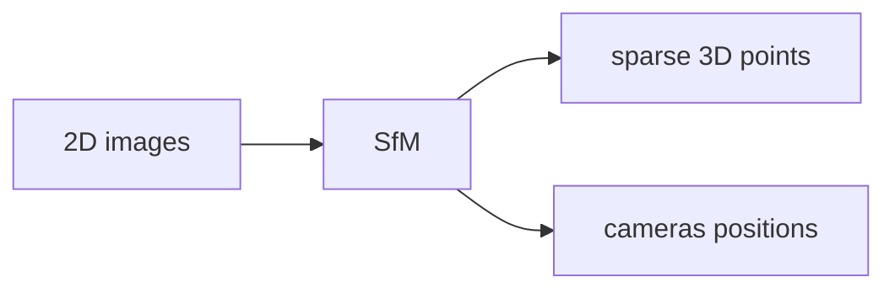
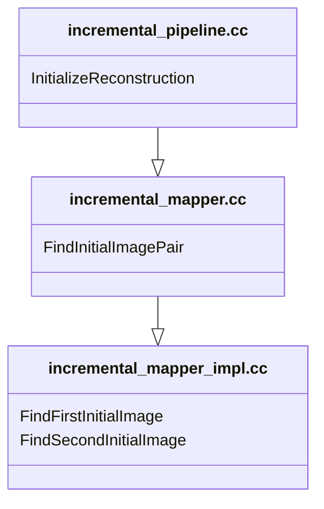
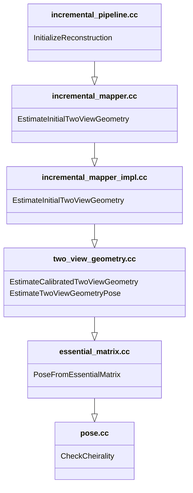
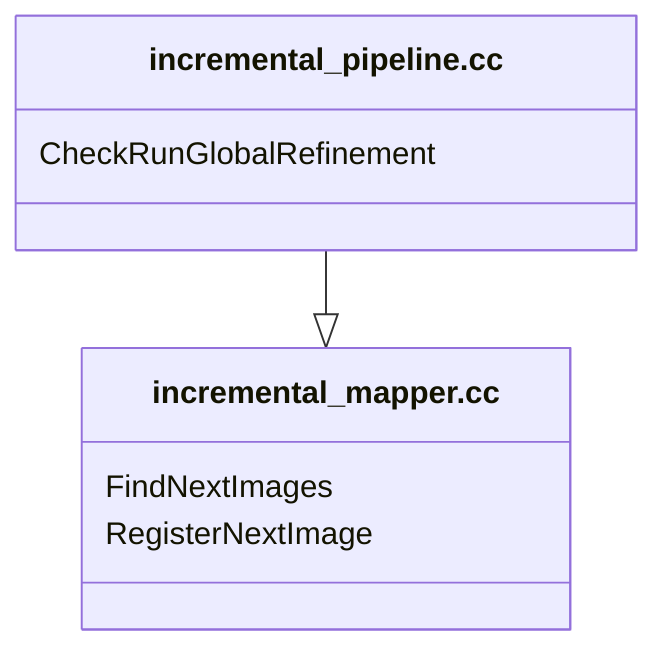
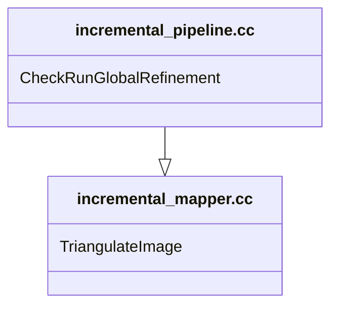
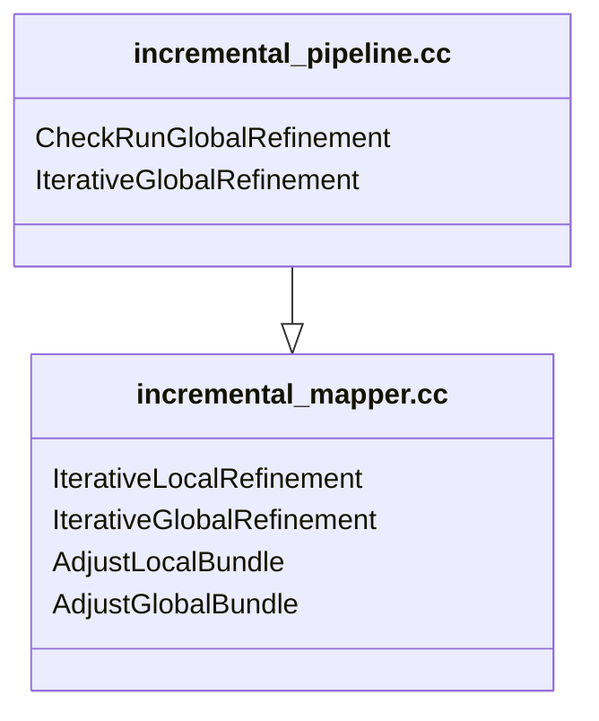
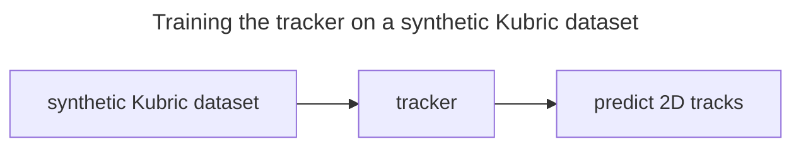
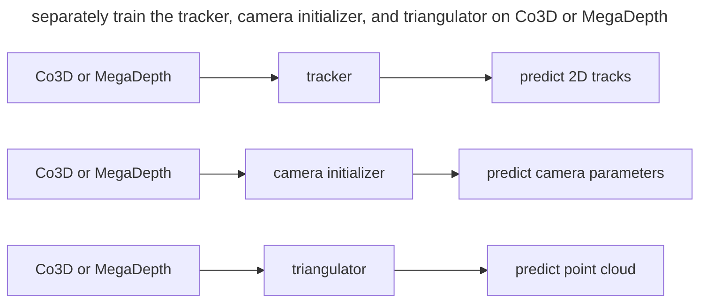

> [!WARNING]
> incomplete document

# Structure-from-Motion (SfM): A Tutorial

## Resources
For this tutorial, I collected information from multiple resources:
* Github repositories
  * [colmap](https://github.com/colmap/colmap)
  * [VGGSfM](https://github.com/facebookresearch/vggsfm)
* Books
  * [Multiple View Geometry in Computer Vision](https://www.robots.ox.ac.uk/~vgg/hzbook/)
  * [Computer Vision: Algorithms and Applications](https://szeliski.org/Book/) 
* Courses
  * [16-385 Computer Vision, CMU](https://www.cs.cmu.edu/~16385/s18/lectures/lecture12.pdf)
  * [CMSC426: Computer Vision, University of Maryland](https://cmsc426.github.io/sfm/)
  * [UNIK4690, University of Oslo](https://www.uio.no/studier/emner/matnat/its/nedlagte-emner/UNIK4690/v16/forelesninger/)

## References
```bibtex
@inproceedings{schoenberger2016sfm,
 author     = {Sch\"{o}nberger, Johannes Lutz and Frahm, Jan-Michael},
 title      = {Structure-from-Motion Revisited},
 booktitle  = {Conference on Computer Vision and Pattern Recognition (CVPR)},
 year       = {2016},
}
```

```bibtex
@inproceedings{wang2024vggsfm,
 title      = {VGGSfM: Visual Geometry Grounded Deep Structure From Motion},
 author     = {Wang, Jianyuan and Karaev, Nikita and Rupprecht, Christian and Novotny, David},
 booktitle  = {Proceedings of the IEEE/CVF Conference on Computer Vision and Pattern Recognition},
 pages      = {21686--21697},
 year       = {2024}
}
```

## Why SfM has anything to do with NeRF?

---


NeRF needs cameras positions to cast rays into the scene and render 3D to compute the training loss. Without SfM, NeRF would be shooting rays into the wild.
A nice thing to have if we can do end to end training from 2D images all the way to 3D reconstruction.

## Epipolar geometry
> [!WARNING]
> $X$ ---> structure
> $x, x'$ 
> $P, P'$ ---> motion

> [!WARNING]
> formullas for fundamnetal and essentila matrices

> [!WARNING]
> images for epipolar lines

## colmap

**replace with the image from the paper**

### Initialization
#### Choosing the initial pair of images

these notes were taken from:
https://github.com/colmap/colmap/blob/cb02ca13a57e565c6bfb56f5f88d65dab222cd7b/src/colmap/sfm/incremental_mapper_impl.h

Colmap implements an incremental SfM using three files:
* [incremental_pipeline.cc](https://github.com/colmap/colmap/blob/cb02ca13a57e565c6bfb56f5f88d65dab222cd7b/src/colmap/controllers/incremental_pipeline.cc) under  `colmap/src/colmap/controllers/incremental_pipeline.cc`.
* [incremental_mapper.cc](https://github.com/colmap/colmap/blob/cb02ca13a57e565c6bfb56f5f88d65dab222cd7b/src/colmap/sfm/incremental_mapper.cc) under `colmap/src/colmap/sfm/incremental_mapper.cc`.
* [incremental_mapper_impl.cc](https://github.com/colmap/colmap/blob/cb02ca13a57e565c6bfb56f5f88d65dab222cd7b/src/colmap/sfm/incremental_mapper_impl.cc) under `colmap/src/colmap/sfm/incremental_mapper_impl.cc`.


The function `InitializeReconstruction` inside `colmap/src/colmap/controllers/incremental_pipeline.cc` initializes the reconstruction by calling `FindInitialImagePair` in `colmap/src/colmap/sfm/incremental_mapper.cc`


* `FindFirstInitialImage`: It finds a first image by sorting all images in a way that priortizes images with a large number of correspondences and have camera calibration priors.
* `FindSecondInitialImage`: It orders images in a list where it places at top of the list the images with large number of correspondences to the first image and have camera calibration priors.

Large number of correspondences would make it easy to pair it with a second image, and having camera calibration priors would allow colmap to use the essential matrix $E$ to estimate the camera poses.

#### Estimating two view geometry between the initial pair
In addition to [incremental_pipeline.cc](https://github.com/colmap/colmap/blob/cb02ca13a57e565c6bfb56f5f88d65dab222cd7b/src/colmap/controllers/incremental_pipeline.cc), [incremental_mapper.cc](https://github.com/colmap/colmap/blob/cb02ca13a57e565c6bfb56f5f88d65dab222cd7b/src/colmap/sfm/incremental_mapper.cc), and [incremental_mapper_impl.cc](https://github.com/colmap/colmap/blob/cb02ca13a57e565c6bfb56f5f88d65dab222cd7b/src/colmap/sfm/incremental_mapper_impl.cc) we have two more files to estimate two view geometry between the initial pair of images:

* [two_view_geometry.cc](https://github.com/colmap/colmap/blob/cb02ca13a57e565c6bfb56f5f88d65dab222cd7b/src/colmap/estimators/two_view_geometry.cc) under `colmap/src/colmap/estimators/two_view_geometry.cc`.
* [essential_matrix.cc](https://github.com/colmap/colmap/blob/cb02ca13a57e565c6bfb56f5f88d65dab222cd7b/src/colmap/geometry/essential_matrix.cc) under `colmap/src/colmap/geometry/essential_matrix.cc`.
* [pose.cc](https://github.com/colmap/colmap/blob/cb02ca13a57e565c6bfb56f5f88d65dab222cd7b/src/colmap/geometry/pose.cc) under `colmap/src/colmap/geometry/pose.cc`.



* `EstimateCalibratedTwoViewGeometry`: estimates two-view geometry from calibrated image pair. 
  * Extract corresponding points
  * Estimate epipolar models
  * Estimate planar or panoramic model
  * Determine inlier ratios of different models
* `EstimateTwoViewGeometryPose`: estimates relative pose for two-view geometry.
```cc
  // Try to recover relative pose for calibrated and uncalibrated
  // configurations. In the uncalibrated case, this most likely leads to a
  // ill-defined reconstruction, but sometimes it succeeds anyways after e.g.
  // subsequent bundle-adjustment etc.
```
* `PoseFromEssentialMatrix`: recovers the most probable pose from the given essential matrix.
```cc
// Decompose an essential matrix into the possible rotations and translations.
//
// The first pose is assumed to be P = [I | 0] and the set of four other
// possible second poses are defined as: {[R1 | t], [R2 | t],
//                                        [R1 | -t], [R2 | -t]}
//
// @param E          3x3 essential matrix.
// @param R1         First possible 3x3 rotation matrix.
// @param R2         Second possible 3x3 rotation matrix.
// @param t          3x1 possible translation vector (also -t possible).
```
* `CheckCheirality`
```cc
// Perform cheirality constraint test, i.e., determine which of the triangulated
// correspondences lie in front of both cameras.
//
// @param cam2_from_cam1  Relative camera transformation.
// @param points1         First set of corresponding points.
// @param points2         Second set of corresponding points.
// @param points3D        Points that lie in front of both cameras.
```
### Image Registration
> New images can be registered to the current model by solving the Perspective-n-Point (PnP) problem using feature correspondences to triangulated points in already registered images (2D-3D correspondences). The PnP problem involves estimating the pose $P_c$ and, for uncalibrated cameras, its intrinsic parameters. The set $𝒫$ is thus extended by the pose $P_c$ of the newly registered image (Schönberger and Frahm, 2016). 



* `FindNextImages`: sort images in a way that prioritize images with a sufficient number of visible points.
* `RegisterNextImage`
  * search for 2D-3D correspondences
  * estimate camera parameters
  * pose refinement
  * extend tracks to the newly registered image

### Triangulation
> A newly registered image must observe existing scene points. In addition, it may also increase scene coverage by extending the set of points $𝒳$ through triangulation. A new scene point $X_k$ can be triangulated and added to $𝒳$ as soon as at least one more image, also covering the new scene part but from a different viewpoint, is registered (Schönberger and Frahm, 2016).



### Bundle Adjustment
> Without further refinement, SfM usually drifts quickly to a non-recoverable state. Bundle adjustment is the joint non-linear refinement of camera parameters $P_c$ and point parameters $X_k$ that minimizes the reprojection error:
>
> $E = \sum_j \rho_j \Big( \left\lVert \pi (P_c, X_k) - x_j \right\rVert^{2}_{2} \Big)$
>
> * $\pi$: a function that projects scene points to image space
> * $\rho_j$: the Cauchy function as the robust loss function to potentially down-weight outliers



* `IterativeLocalRefinement`: iteratively calls `AdjustLocalBundle`
* `AdjustLocalBundle`
```cc
  // Adjust locally connected images and points of a reference image. In
  // addition, refine the provided 3D points. Only images connected to the
  // reference image are optimized. If the provided 3D points are not locally
  // connected to the reference image, their observing images are set as
  // constant in the adjustment.
```
* `IterativeGlobalRefinement`: iteratively calls `AdjustGlobalBundle`
* `AdjustGlobalBundle`: Global bundle adjustment using Ceres Solver, which is usually used to solve Non-linear Least Squares problems.

## VGGSfM
From (Wang et al., 2024) appendix A, the training process involves multiple stages:



---


---


> source: (Wang et al., 2024)
---
### Tracker $𝒯$

 

---
### cost volume pyramid

> source: (Yang et al., 2020)

---

### The tracking process:
1. [`runner.py`](https://github.com/facebookresearch/vggsfm/blob/main/vggsfm/runners/runner.py) calls [`track_predictor.py`](https://github.com/facebookresearch/vggsfm/blob/main/vggsfm/models/track_predictor.py) in `predict_tracks` or `predict_tracks_in_chunks` avoid memory issues.
  > runner.py line 1315
  ```python
     fine_pred_track, _, pred_vis, pred_score = track_predictor(
         images_feed,
         split_points,
         fmaps=fmaps_feed,
         fine_tracking=fine_tracking,
     )
  ```
2. [`track_predictor.py`](https://github.com/facebookresearch/vggsfm/blob/main/vggsfm/models/track_predictor.py) calls [`base_track_predictor.py`](https://github.com/facebookresearch/vggsfm/blob/main/vggsfm/models/track_modules/base_track_predictor.py) twice, one for `coarse_predictor` and another for `fine_predictor`.
  > track_predictor.py line 91
  ```python
     # Coarse prediction
     coarse_pred_track_lists, pred_vis = self.coarse_predictor(
         query_points=query_points,
         fmaps=fmaps,
         iters=coarse_iters,
         down_ratio=self.coarse_down_ratio,
     )
     coarse_pred_track = coarse_pred_track_lists[-1]
  ```
3. [base_track_predictor.py](https://github.com/facebookresearch/vggsfm/blob/main/vggsfm/models/track_modules/base_track_predictor.py) takes query points and their feature maps as inputs and returns 2D positions and visibility:
   * input
       ```python
        """
        query_points: B x N x 2, the number of batches, tracks, and xy
        fmaps: B x S x C x HH x WW, the number of batches, frames, and feature dimension.
                note HH and WW is the size of feature maps instead of original images
        """
      ```
   * output
       ```python
        if return_feat:
            return coord_preds, vis_e, track_feats, query_track_feat
        else:
            return coord_preds, vis_e
       ```


|stage|input|output|
| :--- | :--- | :--- |
|Tracker $𝒯$  |2D query points|A track for each query point. The length of a track is $N_I$, which is number of frames. The track contains 2D locations $y_i^j$ and visibility $v_i^j$|
|1000 |0.3115|0.9848|
|2000 |0.3293|0.9877|
|5000 |0.3831|0.9891|
|7000 |0.2774|0.9893|
|10000|0.3059|0.9896|
